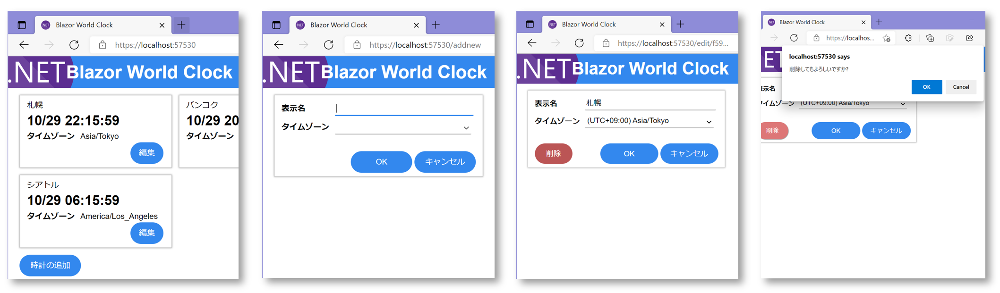

📖 Blazor WebAssembly アプリケーションプログラミング自習書
============================================

🗨️ 概要
----------------------------------------

まずタイトルにある **"Blazor (ブレイザー)"** ですが、これは、**C# 言語を用いて Single Page Web アプリケーション (SPA) を開発、実行**する、フレームワーク/実行環境/開発環境です。

本書が対象としている Blazor WebAssembly では、C# ソースコードを **JavaScript に変換するのではなく**、Web ブラウザの **WebAssembly 上に構築された .NET 実行環境が .NET アセンブリ (.dll) をそのまま読み込み、アセンブリ 内の IL (中間言語) を解釈・実行**します。

本書は、題目の Web アプリケーションを Blazor WebAssembly で開発する手順を1ステップずつ解説し、  
「Blazor WebAssembly のプログラミングってどんな感じなの?」  
「Blazor ってどこがメリットなの?」  
といった疑問にお答えできることを狙いとした、Blazor についての事前評価ができるような、そんな入門レベルの自習書テキストです。

なお、本書が対象としている Blazor のバージョンは v.6.0.0 です。  
(GitHub リポジトリには、本書の旧バージョン対応版も履歴に含まれています)

🚀 本書で開発する Web アプリ
----------------------------------------

本書では、ページ上に複数のタイムゾーンの現在時刻を一斉表示する「世界時計」 Web アプリを Blazor WebAssembly を使って実装します。  
表示する時計の表示用の名称とタイムゾーンを、追加、変更、削除するページを備えます。

下記 URL で完成版を公開しています。

- https://jsakamoto.github.io/self-learning-materials-for-blazor-jp/

📖 自習書テキストとソースコード
----------------------------------------

自習書テキストは PDF ファイルとして提供しており、下記リンクから参照できます。

- [📒 Blazorアプリケーションプログラミング自習書-v.6.0.0.pdf](https://jsakamoto.github.io/self-learning-materials-for-blazor-jp/Blazor%E3%82%A2%E3%83%97%E3%83%AA%E3%82%B1%E3%83%BC%E3%82%B7%E3%83%A7%E3%83%B3%E3%83%97%E3%83%AD%E3%82%B0%E3%83%A9%E3%83%9F%E3%83%B3%E3%82%B0%E8%87%AA%E7%BF%92%E6%9B%B8-v.6.0.0.pdf)

この自習書テキストに沿って作業を進めることで、**Blazor WebAssembly プログラミングの主だった構成要素を習得・体験**しつつ、**IDE 支援がどのように役立つか**も体験することができます。

また、本リポジトリの [v.6.0.0 ブランチ](https://github.com/jsakamoto/self-learning-materials-for-blazor-jp/commits/v.6.0.0)には、自習書テキストで解説している 1 ステップを 1 コミットとして履歴を記録したソースコードが収録されています。  
適宜ご参照ください。

なお、自習書テキスト PDF および 1 ステップごとのソースコードを収録した Zip ファイルを、[GitHub リポジトリの Release ページ](https://github.com/jsakamoto/self-learning-materials-for-blazor-jp/releases)からダウンロードできます。  

本格的に本自習書に取り組んでみる際は、**上記 Release ページで配付している Zip ファイルを入手して開始されるのがお勧め**です。

👪 想定する本自習書の利用者層
----------------------------------------

本自習書では、サーバー側実装として ASP.NET Core を採用しています。  
また Blazor は基本的にプログラミング言語は C# が想定されています。

そのため、本自習書では下記のような開発者を想定しております。

- HTML/CSS/JavaScript を用いた Web アプリケーション開発の知識がある
- C# によるプログラミングの知識がある
- 加えて ASP.NET Core によるサーバーサイド Web アプリケーション開発の知識があるとなお可

> ※ Angular, React, Vue などといった JavaScript SPA フレームワークの知識・経験は必ずしも必要としないことと考えていますが、もし何かしら SPA フレームワークの知識・経験があれば、Blazor の理解にも役立つと思います。

🛠️ 必要な開発環境
----------------------------------------

本稿執筆時点で、本自習書による Blazor 開発を実践するにあたり必要な開発環境は下記のとおりです。

- [.NET Core 6.0 SDK (6.0.100 かそれ以降)](https://dotnet.microsoft.com/download/dotnet-core/6.0)
- [Visual Studio 2022- 17.0.0 以降](https://visualstudio.microsoft.com/vs/)
    - "ASP.NET と Web 開発" ワークロードが選択されていること
- 以上の環境をインストールし利用可能な Windows OS

なお、本自習書では Windows OS 上で Visual Studio 2022 17.0.0 以降を使っての手順で説明しておりますが、Blazor アプリ開発にあたっては、最低限、 

- [.NET Core 6.0 SDK (6.0.100 かそれ以降)](https://dotnet.microsoft.com/download/dotnet-core/5.0)
- および任意のテキストエディタ 

さえあれば、"dotnet" CLI (Command Line Interface) を用いて、Linux 各種ディストリビューションや macOS 上でも実践可能です。

特にテキストエディタとして、**Visual Studio Code** を用い、これに **["C# for Visual Studio Code" 拡張 v.1.23.6以上](https://marketplace.visualstudio.com/items?itemName=ms-vscode.csharp)** をインストールして使用する場合は、本自習書で説明しているような Visual Studio 2022 と同等の開発支援が得られます。

 本自習書は、Windows OS 上で Visual Studio 2022 17.0.0 以降を使っての手順で説明していますが、上記のとおり、その他の OS、任意の IDE やエディタでも本自習書に基づいて学習が可能です。  
 また、ソースコードには、Visual Studio Code による開発がすぐに行えるようタスク設定 (`.vscode` フォルダ) も同梱しています。

> ※1 - Visual Studio 2022 は、無償利用可能な (但しライセンス条項に違反しない場合) Community Edition で可。  
> ※2 - Visual Studio は、複数のバージョンやインスタンスを、ひとつの OS 上に互いの干渉なくいくつもインストールして使用することが可能です。

 🤔 自習書作成の背景
----------------------------------------

Blazor は SPA アプリケーション開発のシーンにおいて、もちろん決して ["銀の弾丸"](https://kotobank.jp/word/%E9%8A%80%E3%81%AE%E5%BC%BE%E4%B8%B8-248402) ではありません。  
しかしながら Blazor は、適合する案件や開発者であれば、**開発の負担を減らし、よりよい生産性向上をもたらす可能性**を秘めています。

そこでこの Blazor の可能性をより多くの開発者に体験していただき、Blazor WebAssembly を事前評価していただければと考え、この「Blazor WebAssembly アプリケーションプログラミング自習書 (自習教材)」を作成しました。

📣 ライセンス
----------------------------------------

本 GitHub リポジトリに含まれる自習書テキスト、及び、ソースコードは、[The Unlicense](LICENSE) として提供します。

商用・非商用に関係なく、また、クレジット表示も不要で、本リポジトリに含まれるテキストやソースコードを再利用・改変・再配布が可能です。

📩 サポート
----------------------------------------

本自習書は個人が自主的に無償で公開・提供するものであり、サポートはありません。

本自習書に関して、質問や連絡事項などある場合は、本 GitHub リポジトリの [Issue](https://github.com/jsakamoto/self-learning-materials-for-blazor-jp/issues) を利用ください。

🔗 関連リソース
----------------------------------------

- Blazor 公式 GitHub リポジトリ - [https://github.com/aspnet/AspNetCore/tree/master/src/Components](https://github.com/aspnet/AspNetCore/tree/master/src/Components)
- Blazor 公式サイト - [https://blazor.net/](https://blazor.net/)
    - "Get started with Blazor" - [https://blazor.net/docs/get-started.html](https://blazor.net/docs/get-started.html)
- Blazor 関連リンク集 (英語) "Awesome Blazor" - [https://github.com/AdrienTorris/awesomeblazor](https://github.com/AdrienTorris/awesomeblazor#awesome-blazor-) 